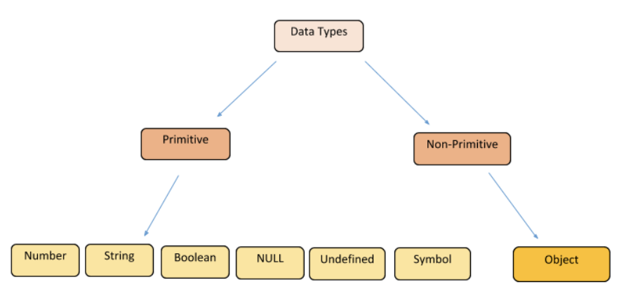
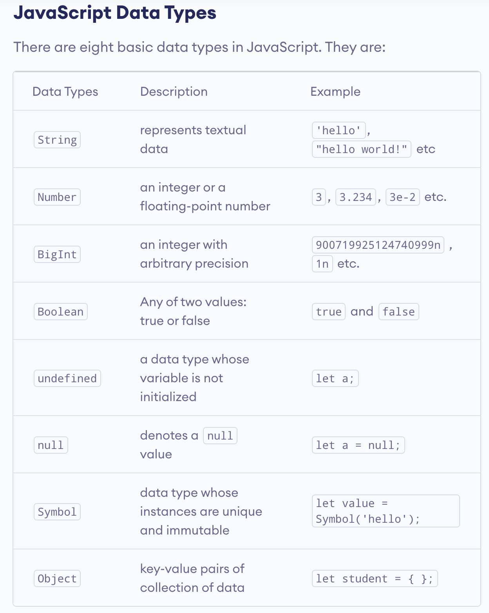

# TOC

[Question 1: Source control for large project](#q1)

[Question 2: Quality software](#q2)

[Question 3: MERN stack](#q3)

[Question 4: Mmall business project](#q4)

[Question 5: Project reflection, required skills](#q5)

[Question 6: Project reflection, changes ](#q6)

[Question 7: Control flow](#q7)

[Question 8: Type coercion ](#q8)

[Question 9: Data types](#q9)

[Question 10: Array Manipulation](#q10)

[Question 11: Object Manipulation](#q11)

[Question 12: JSON Manipulation](#q12)

[Question 13: Code snippet commets](#q13)

---

<a name="q1"/></a>
# Q1: Provide an overview and description of a standard source control process for a large project

---
<a name="q2"/></a>
# Q2: What are the most important aspects of quality software?

---
<a name="q3"/></a>
# Q3: Outline a standard high level structure for a MERN stack application and explain the components

---
<a name="q4"/></a>
# Q4: A team is about to engage in a project, developing a website for a small business. What knowledge and skills would they need in order to develop the project?

---
<a name="q5"/></a>
# Q5: With reference to one of your own projects, discuss what knowledge or skills were required to complete your project, and to overcome challenges

---
<a name="q6"/></a>
# Q6: With reference to one of your own projects, evaluate how effective your knowledge and skills were for this project, and suggest changes or improvements for future projects of a similar nature

---
<a name="q7"/></a>
# Q7: Explain control flow, using an example from the JavaScript programming language

---
<a name="q8"/></a>
# Q8: Explain type coercion, using examples from the JavaScript programming language

## What is type coercion?

- According to MDN Web Docs "Type coercion is the automatic or implicit conversion of values from one data type to another".
- For example, JS may perform type coercion to change a number to a string.

---

## Type coercion with the + operator:

- The JavaScript engine will attempt to add values on either side of the + operator if both values are of the number data type. See the example below:
- Here the JS Engine has **No Implicit Type coercion:**

```jsx
20 + 20 // returns 40 
```

---

- In the next example, we have a `number + a string`.
- Here the JS Engine converts the other value to a string so that they can be appended and works as string concatenation

```jsx
20 + '20' // returns 2020
```

---

- Below are more examples of Javascript performing type coercion with the + operator

```jsx
1 + "2"  // returns "12"
1 + "ab" // returns "1ab"
```

---

- JavaScript will also perform type coercion with multiple values.
- In the examples below, JavaScript first performs the addition with the + operator, then performs type coercion with the result of the addition and the following string.

```jsx
1 + 2 + "1" //returns "31"

1 + 2 + "2" // returns "32"

2 + 5 + "a" // returns "7a"
```

---

## Type coercion with the - operator

- The JavaScript engine will attempt to subtract values on either side of the - operator if both values are of the number data type. See the example below:

```jsx
20 - 20 // returns 0 
```

---

- In the next example, we have a `number - a string`.
- Here the JS Engine converts the string to a number to perform the subtraction operation.

```jsx
20 - "20" // returns 0 
```

[https://medium.com/developers-arena/type-coercion-in-javascript-c973b369b272](https://medium.com/developers-arena/type-coercion-in-javascript-c973b369b272)

[https://medium.com/@allansendagi/advanced-javascript-concepts-type-coercion-b4137c87c766](https://medium.com/@allansendagi/advanced-javascript-concepts-type-coercion-b4137c87c766)

[https://www.geeksforgeeks.org/what-is-type-coercion-in-javascript/](https://www.geeksforgeeks.org/what-is-type-coercion-in-javascript/)

[https://dorey.github.io/JavaScript-Equality-Table/](https://dorey.github.io/JavaScript-Equality-Table/)

[https://developer.mozilla.org/en-US/docs/Glossary/Type_coercion](https://developer.mozilla.org/en-US/docs/Glossary/Type_coercion)

[https://dev.to/promhize/what-you-need-to-know-about-javascripts-implicit-coercion-e23](https://dev.to/promhize/what-you-need-to-know-about-javascripts-implicit-coercion-e23)

---
<a name="q9"/></a>
# Q9: Explain data types, using examples from the JavaScript programming language

---

- A **value** in JavaScript is always of a **certain data type**. In JavaScript, there are 8 different data types:

    ---

    - [Boolean type](https://developer.mozilla.org/en-US/docs/Web/JavaScript/Data_structures#boolean_type)
    - [Null type](https://developer.mozilla.org/en-US/docs/Web/JavaScript/Data_structures#null_type)
    - [Undefined type](https://developer.mozilla.org/en-US/docs/Web/JavaScript/Data_structures#undefined_type)
    - [Number type](https://developer.mozilla.org/en-US/docs/Web/JavaScript/Data_structures#number_type)
    - [BigInt type](https://developer.mozilla.org/en-US/docs/Web/JavaScript/Data_structures#bigint_type)
    - [String type](https://developer.mozilla.org/en-US/docs/Web/JavaScript/Data_structures#string_type)
    - [Symbol type](https://developer.mozilla.org/en-US/docs/Web/JavaScript/Data_structures#symbol_type)
    - [Objects](https://developer.mozilla.org/en-US/docs/Web/JavaScript/Data_structures#objects)

---

## Primitive values & Objects

- The above list can be broken down into **Primitive values** and **Objects.**
- The easiest way to think about this is:
    - All types are primitive values except for objects.

---



---

### Primitive Data Types in JavaScript

- In JavaScript, primitive data types refer to a single value.

---

### For example:

```jsx
let a = 5;
```

---

- In the example, we have declared a variable `a` with the number 5 assigned to its value.
- Importantly, this variable `a` refers to a single value in memory.
- Therefore, in order to change the value of this variable `a`, we will need to assign it with a new value.
- This illustrates how primitive data types are not mutable.
- In this manner, if we change the value of `a` to be 6, it will not change the value of the original `a` variable.

```jsx
let a = 6;
```

- Rather, JavaScript will create a new variable `a` with the number 6 assigned to its value.

---

### Non Primitive Data types in JavaScript

- In JavaScript, non-primitive types are objects.

---

"Whenever we refer to an object, we refer to an address in memory which contains the key-value pair. If we assign an object ‘object1’ to another object ‘object2’, we are actually assigning the address of ‘object1’ to ‘object2’ instead of the key-value pair which the ‘object1’ contains in memory. Let’s see below”.

"When we compare two objects, we compare their addresses, not their values."

---

- Given JavaScript is  “dynamically typed”, variables are not bound to any specific data type.

### For example:

```jsx
let exampleVaribale = "string";
exampleVaribale = 123456;
```

- Here we have declared the variable `exampleVaribale` and assigned it to the **string** data type.
- Then we change the value of the `exampleVaribale` to be of the **number** data type.
- This will produce **no error**s in JavaScript given it is a “dynamically typed” language.
- In other languages which are not “dynamically typed”, the example above would produce an error.

---

## Number:

[https://blog.devgenius.io/what-are-the-eight-data-types-of-javascript-3819b38c8e53](https://blog.devgenius.io/what-are-the-eight-data-types-of-javascript-3819b38c8e53)

[https://javascript.info/types](https://javascript.info/types)

[https://www.programiz.com/javascript/data-types](https://www.programiz.com/javascript/data-types)



---
<a name="q10"/></a>
# Q10: Explain how arrays can be manipulated in JavaScript, using examples from the JavaScript programming language

### Link to code for array manipulation:
- Click [here](https://github.com/IsaacCavallaro/IsaacCavallaro_T3A1/blob/main/arrayManipulation.js) for the array manipulation code.

---

- In JavaScript, array manipulation refers to such tasks as:
    - Adding elements in an array.
    - Removing elements in an array.
    - Transforming elements in an array.

---

- There are two categories to which array manipulation refers:
    - Destructive.
    - Non-destructive.

---

## Destructive

- Destructive methods will change the array in memory.
- Therefore, your original array will have been "destructed".

---

## Non-destructive

- Non-destructive methods will produce a copy of the original array.
- This copy will have the manipulations while your original array remains intact.

---

## `toString()`

- Converts an array to a string with each item separated by a comma.

---

### Example One: `toString()`

- Converting an array of **strings to a string** with each item **separated by a comma.**

---

```jsx
let names = ['ben', 'tim', 'sam']
```

- We can use the `toString()` method on the `names` variable.

```jsx
names.toString()
```

- We can then log the result of using `toString()` on the `names` variable.

```jsx
console.log(names.toString())
```

- This will return in the console:

```jsx
ben,tim,sam
```

- To confirm this has converted the array to the **string** data type we can:
    - Save to a new variable and use `typeof` to check the data type.

```jsx
let names = ['ben', 'tim', 'sam']

let newNames = names.toString()

console.log(typeof newNames) // string 
```

- To check if our original array has been manipulated we can log out `newNames` and `names`

```jsx
let names = ['ben', 'tim', 'sam']

let newNames = names.toString()

console.log(newNames) // ben,tim,sam
console.log(names) // [ 'ben', 'tim', 'sam' ]
```

- We have access to both our manipulated array `newNames` and our original array `names`.
- Therefore this is a non-destructive method.

---

### Example Two: `toString()`

- Converting an array of **numbers to a string** with each item **separated by a comma.**

```jsx
let numbers = [1, 2, 3]
```

- We can use the `toString()` method on the `numbers` variable.

```jsx
numbers.toString()
```

- We can then log the result of using `toString()` on the `numbers` variable.

```jsx
console.log(numbers.toString())
```

- This will return in the console:

```jsx
1,2,3
```

- To confirm this has converted the array to the **string** data type we can:
    - Save to a new variable and use `typeof` to check the data type.

```jsx
let numbers = [1, 2, 3]

newNumbers = numbers.toString()

console.log(typeof newNumbers) // string 
```

- To check if our original array has been manipulated we can log `newNumbers` and `numbers`.

```jsx
let numbers = [1, 2, 3]

newNumbers = numbers.toString()

console.log(newNumbers) // 1,2,3
console.log(numbers) // [1,2,3]
```

- We have access to both our manipulated array `newNumbers` and our original array `numbers`.
- Therefore this is a **non-destructive method.**

---

## `.join()`

- Combine all the items in an array into a string.
- Although it is similar to `.toString()`, the `.join()` method can **specify** what character you want to use to separate each item in the array.
- By default, it will separate items with a comma.

---

### Example One: `.join()`

- Converting an array of **strings to a string** with each item **separated by a $.**

```jsx
let names = ['ben', 'tim', 'sam']
```

- We can use the `.join()` method on the `names` variable and pass '$'

```jsx
names.join('$')
```

- We can then log the result of using `.join()`on the `names` variable with the $ passed.

```jsx
console.log(names.join('$'))
```

- This will return in the console:

```jsx
ben$tim$sam
```

- To confirm this has converted the array to the **string** data type we can:
    - Save to a new variable and use `typeof` to check the data type.

```jsx
let names = ['ben', 'tim', 'sam']

let newNames = names.join('$')

console.log(typeof newNames) // string
```

- To check if our original array has been manipulated we can log `newNames` and `names`.
- This time, we can log the original array before and after the `join()` method to further illustrate see if there are any changes (this may be misleading due to memory but for now it serves its purpose).

```jsx
let names = ['ben', 'tim', 'sam']

console.log(names) // [ 'ben', 'tim', 'sam' ]

let newNames = names.join('$')

console.log(newNames) // ben$tim$sam
console.log(names) // [ 'ben', 'tim', 'sam' ]
```

- We have access to both our manipulated array `newNames` and our original array `names`.
- Therefore this is a non-destructive method.

---

### Example Two: `.join()`

- Converting an array of **strings to a string** with each item **separated by a space.**

```jsx
let names = ['ben', 'tim', 'sam']
```

- We can use the `.join()` method on the `names` variable and pass a space

```jsx
names.join(' ')
```

- We can then log the result of using `.join()`on the `names` variable with a space passed.

```jsx
console.log(names.join(' '))
```

- This will return in the console:

```jsx
ben tim sam
```

---

## `.splice()`

- The `splice()` method changes the elements of an array by:
    - Adding new elements in place.
    - Removing or replacing existing elements.

---

### Example One: `.splice()`

- Add a new element/item to our array of strings (without removing any elements).

```jsx
let names = ['ben', 'tim', 'sam']
```

- Add 'fred' to the `names` array at index 1 **without** deleting any other items in the `names` array.

```jsx
names.splice(1, 0, 'fred')
```

- We can then log the result of using `.splice()`in this way.

```jsx
console.log(names.splice(1, 0, 'fred'))
```

- This will return in the console an empty array:

```jsx
[]
```

- To see what is happening further we can log the `names` variable after performing `splice()`

```jsx
let names = ['ben', 'tim', 'sam']

names.splice(1, 0, 'fred')

console.log(names)
```

- This will return to the console our manipulated array:

```jsx
[ 'ben', 'fred', 'tim', 'sam' ]
```

- To double check if our original `names` array has been manipulated after using the `.splice()` method we can save it to a new variable and log out the array before and after using `.splice()`

```jsx
let names = ['ben', 'tim', 'sam']

console.log(names) // [ 'ben', 'tim', 'sam' ]

newNames = names.splice(1, 0, 'fred')

console.log(newNames) // []
console.log(names) // [ 'ben', 'fred', 'tim', 'sam' ]
```

- Interestingly, as we saw above, when we log the `newNames` variable, we are returned with an empty array.

```jsx
console.log(newNames) // []
```

- This is because the `splice()` function returns the array of the **removed elements.**
- In this example, we did not remove any elements so our returned array from `splice()` is empty.
- Importantly, our `names` variable which stores our original array HAS been manipulated which means the `splice()` function is **destructive**.

---

### Example Two: `.splice()`

- Add a new element/item to our array of strings and remove an item.

```jsx
let names = ['ben', 'tim', 'sam']
```

- Add 'fred' to the `names` array at index 1 **while** deleting the current item at index 1 ('tim')

```jsx
names.splice(1, 1, 'fred')
```

- We can then log the result of using `.splice()`in this way.

```jsx
console.log(names.splice(1, 1, 'fred'))
```

- This will return to our console the removed item at index 1 from the `names` array.

```jsx
[ 'tim' ]
```

- Now if we log `names` to the console before and after we perform `.splice()` we will see how the original array has been manipulated:

```jsx
let names = ['ben', 'tim', 'sam']

console.log(names) // [ 'ben', 'tim', 'sam' ]
console.log(names.splice(1, 1, 'fred')) // [ 'tim' ]
console.log(names) // [ 'ben', 'fred', 'sam' ]
```

## `.slice()`

- The `.slice()` method will copy a specified part of an array and return the copied part.
- Importantly. `.slice()` will not change the original array so it is considered non-destructive.

---

### Example One: `.slice()`

- Use the `.slice()` method to return an array that has been sliced from index 0 to index 2

```jsx
let numbers = [1, 2, 3]
console.log(numbers.slice(0, 2))
```

- This will return in the console:

```jsx
[1,2]
```

- As stated above, `.slice()` is non-destructive so if we log the original `numbers` array, it will still have the same items in it:

```jsx
let numbers = [1, 2, 3]
console.log(numbers.slice(0, 2)) // [1,2]
console.log(numbers)// [1,2,3]
```

- With this in mind, if we want to do something with the new array, we will need to assign it to a new variable.

```jsx
let numbers = [1, 2, 3]
let newNumbers = numbers.slice(0, 2)
console.log(newNumbers) // [1,2]
console.log(numbers) // [1,2,3]
```


<a name="q11"/></a>
# Q11: Explain how objects can be manipulated in JavaScript, using examples from the JavaScript programming language

---
<a name="q12"/></a>
# Q12: Explain how JSON can be manipulated in JavaScript, using examples from the JavaScript programming language

[https://docs.npmjs.com/cli/v7/configuring-npm/package-json](https://docs.npmjs.com/cli/v7/configuring-npm/package-json)

---
<a name="q13"/></a>
# Q13: For the code snippet provided below, write comments for each line of code to explain its functionality. In your comments you must demonstrate your ability to recognise and identify functions, ranges and classes

## Original Code:

```jsx
class Car {
  constructor(brand) {
    this.carname = brand;
  }
  present() {
    return 'I have a ' + this.carname;
  }
}

class Model extends Car {
  constructor(brand, mod) {
    super(brand);
    this.model = mod;
  }
  show() {
    return this.present() + ', it was made in ' + this.model;
  }
}

let makes = ["Ford", "Holden", "Toyota"]
let models = Array.from(new Array(40), (x,i) => i + 1980)

function randomIntFromInterval(min,max) { // min and max included
    return Math.floor(Math.random()*(max-min+1)+min);
}

for (model of models) {

  make = makes[randomIntFromInterval(0,makes.length-1)]
  model = models[randomIntFromInterval(0,makes.length-1)]

  mycar = new Model(make, model);
  console.log(mycar.show())
}
```

---

## Breakdown of code:

```jsx
class Car {
  constructor(brand) {
    this.carname = brand;
  }
  present() {
    return 'I have a ' + this.carname;
  }
}
```

---

```jsx
class Model extends Car {
  constructor(brand, mod) {
    super(brand);
    this.model = mod;
  }
  show() {
    return this.present() + ', it was made in ' + this.model;
  }
}
```

---

```jsx
// Create new array with a length of 3
// Store in a variable called makes

let makes = ["Ford", "Holden", "Toyota"]
```

---

```jsx
// Create a new array with a length of 40
// Index 0 will be 1980 
// Increment 1980 + i until array length is 40
// Store the new array in a variable called models

let models = Array.from(new Array(40), (x,i) => i + 1980)
```

---

```jsx
function randomIntFromInterval(min,max) { // min and max included
    return Math.floor(Math.random()*(max-min+1)+min);
}
```

---

```jsx

// Iterate over the models array
//

for (model of models) {

  make = makes[randomIntFromInterval(0,makes.length-1)]
  model = models[randomIntFromInterval(0,makes.length-1)]

  mycar = new Model(make, model);
  console.log(mycar.show())
}
```

---

# References

[https://dannydevelops.medium.com/destructive-vs-non-destructive-array-methods-with-javascript-77a680a969bd](https://dannydevelops.medium.com/destructive-vs-non-destructive-array-methods-with-javascript-77a680a969bd)

[https://developer.mozilla.org/en-US/docs/Web/JavaScript/Reference/Global_Objects/Array](https://developer.mozilla.org/en-US/docs/Web/JavaScript/Reference/Global_Objects/Array)

[https://levelup.gitconnected.com/understanding-javascript-coercion-in-a-dynamically-typed-language-8807d6331fa2](https://levelup.gitconnected.com/understanding-javascript-coercion-in-a-dynamically-typed-language-8807d6331fa2)

[https://www.edureka.co/blog/data-types-in-javascript/](https://www.edureka.co/blog/data-types-in-javascript/)